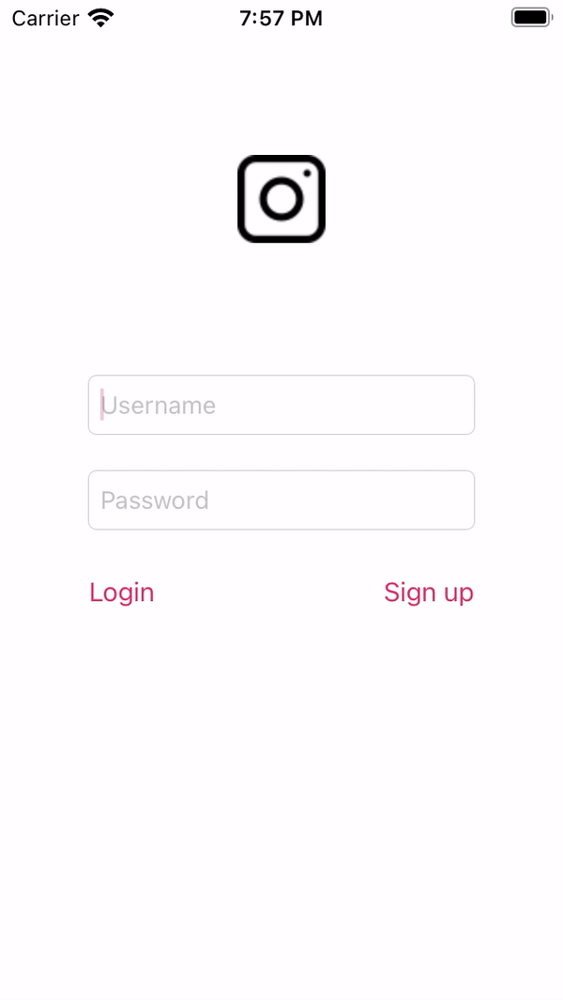

# Project 4 - *Instagram Clone*

This basic **Instagram** clone is a photo sharing app using Parse as its backend.

Time spent: **18** hours spent in total

## User Stories

The following **required** functionality is completed:

- [x] User can sign up to create a new account using Parse authentication
- [x] User can log in and log out of his or her account
- [x] The current signed in user is persisted across app restarts
- [x] User can take a photo, add a caption, and post it to "Instagram"
- [x] User can view the last 20 posts submitted to "Instagram"
- [x] User can pull to refresh the last 20 posts submitted to "Instagram"
- [x] User can tap a post to view post details, including timestamp and caption.

The following **optional** features are implemented:

- [x] Run your app on your phone and use the camera to take the photo
- [ ] User can load more posts once he or she reaches the bottom of the feed using infinite scrolling.
- [x] Show the username and creation time for each post
- [ ] User can use a Tab Bar to switch between a Home Feed tab (all posts) and a Profile tab (only posts published by the current user)
- User Profiles:
  - [ ] Allow the logged in user to add a profile photo
  - [ ] Display the profile photo with each post
  - [ ] Tapping on a post's username or profile photo goes to that user's profile page
- [x] After the user submits a new post, show a progress HUD while the post is being uploaded to Parse
- [ ] User can comment on a post and see all comments for each post in the post details screen.
- [ ] User can like a post and see number of likes for each post in the post details screen.
- [ ] Style the login page to look like the real Instagram login page.
- [ ] Style the feed to look like the real Instagram feed.
- [ ] Implement a custom camera view.

The following **additional** features are implemented:

- [x] Alerts for empty user credentials, failure to load posts, and failure to post images

Please list two areas of the assignment you'd like to **discuss further with your peers** during the next class (examples include better ways to implement something, how to extend your app in certain ways, etc):

1. More about the Parse iOS SDK's built-in objects and UI components
2. Best practices for structuring reusable UI code in Objective-C

## Video Walkthrough

Here's a walkthrough of implemented user stories:

GIF created with [EZGIF.COM](https://ezgif.com/video-to-gif).

## Credits

List an 3rd party libraries, icons, graphics, or other assets you used in your app.

- [AFNetworking](https://github.com/AFNetworking/AFNetworking) - networking task library
- [CodePath Instagram Assets for iOS](https://courses.codepath.org/course_files/ios_university_fast_track/assets/instagram_assets.zip) - app icon and image assets
- [DateTools](https://github.com/MatthewYork/DateTools) - date and time handling library
- [Parse](https://github.com/parse-community/Parse-SDK-iOS-OSX) - relational database backend library
- [ParseUI](https://cocoapods.org/pods/ParseUI) - user interface components used with Parse

## Notes

*Describe any challenges encountered while building the app.*

When implementing login and signup, I ran into some issues with a error checking method I made, setUserCredentials. The method checks for an empty username or password before setting the user object's properties, and displays an alert about this in lieu of attempting login or signup . However, the method was mysteriously crashing the app without displaying an alert.

I discovered that my return statements in setUserCredentials caused the username and password properties to be blank, but then be passed to Parse to attempt login or signup. In the end, I modified the method's return type from void to BOOL, added booleans to my return statements, and finally changed my login and signup methods to use the boolean value to determine whether the entered credentials are sufficient to attempt login or signup.

## License

    Copyright 2021 Matthew Ponce de Leon

    Licensed under the Apache License, Version 2.0 (the "License");
    you may not use this file except in compliance with the License.
    You may obtain a copy of the License at

        http://www.apache.org/licenses/LICENSE-2.0

    Unless required by applicable law or agreed to in writing, software
    distributed under the License is distributed on an "AS IS" BASIS,
    WITHOUT WARRANTIES OR CONDITIONS OF ANY KIND, either express or implied.
    See the License for the specific language governing permissions and
    limitations under the License.
